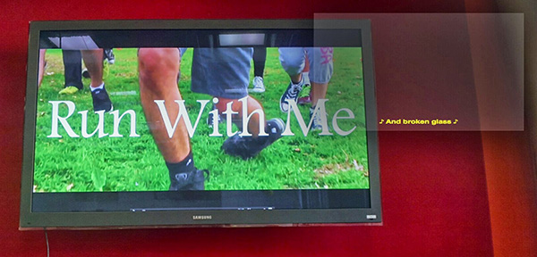

*In collaboration with the Global Event and Media Accessibility Initiative and Marc Bovee*

In partnership with the Global Event and Media Accessibility Initiative, the Annenberg Innovation Lab is exploring new ways of enhancing access to media content using ocular wearable devices like Google Glass. Our goal is to allow audiences, regardless of their physical needs or preferred communication methods, to watch a film or television show on a main screen (ideally at any cinema or in their own home) and immediately, seamlessly select from a range of supplementary content streams on their wearable device. Although this project builds on the same framework the Annenberg Innovation Lab uses in our Augmented Storytelling prototype, which displays complementary audiovisual materials such as director's commentary while a viewer watches a media property, our goal in the Augmenting Accessibility prototype is slightly different: Here, rather then offer what we might think of as "bonus features" through a wearable device, we instead seek to provide users with convenient access to additional language assets to help them more fully consume and engage with whatever they're watching, on their own terms and through their chosen form of communication.

The additional content streams we consider in this project might include subtitles in a variety of languages or audio description for the visually impaired, as have been introduced in some theatres already using various proprietary devices. However, wearables like Glass also make possible new sorts of individualized, multi-layered viewing experiences, including the SliverWindowASL prototype premiering here. Recognizing the 90 million people worldwide who communicate primarily through visual means, including children who cannot or prefer not to read written words, Marc Bovee has designed his SliverWindowASL technology to provide American Sign Language video components that can be played alongside media content. This demonstration features English subtitles, audio description, and SliverWindowASL experiences, accessed via Google Glass, accompanying Cameron Covell’s short film “Run With Me.”

