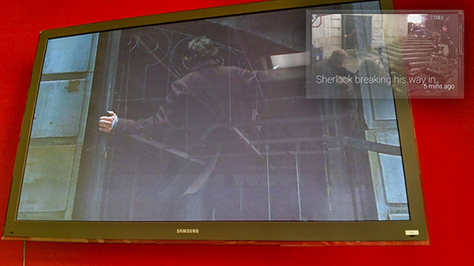

How might wearable computing devices be used to tell unique, hyperpersonalized stories? In this prototype, we explored how Google Glass might be used for asymmetric synchronous TV experiences - in other words, how two people might watch the same show on the same couch at the same time, but enjoy two different experiences. In this prototype, by feeding the director’s commentary assets (audio, video, text and/or image) to Glass, the Glass-wearer can experience the movie augmented by the director’s commentary while the other person experiences only the movie.

A second concept posited two viewers, both wearing Glass, being fed different content from two “commentator” characters via Glass. For example, an augmented mystery story might have one viewer’s commentator whisper in their ear, “Character A is lying, because of X”, and a second viewer’s commentator may whisper, “Character B is lying, because of Y”. At the end, the viewers work together to piece together what their commentators told them to crack the case.

This project shares a technical framework with the Annenberg Innovation Lab's Augmenting Accessibility prototype, which seeks to use wearable technology to provide users with convenient access to additional language assets to help them more fully consume and engage with whatever they're watching, on their own terms and through their chosen form of communication.
