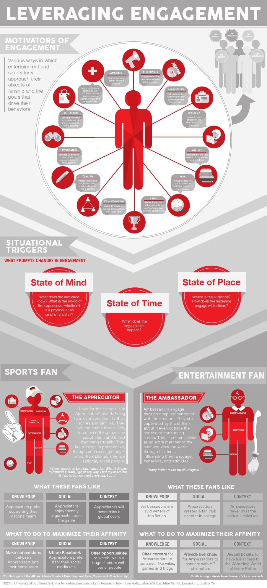

[__Fanalytica__](https://fanalytica.ai) is a consumer insights platform.
We don’t just monitor or listen. Anyone can do that. Fanalytica predicts responses to personalized journeys based on fan motivations.

The questions that are not addressed in any industry – WHY is a fan motivated, and WHAT triggers the fan behaviors? We answer those questions through natural language processing and establishing a high accuracy deep learning model.

Not to be confused with an audience—an assembly of listeners or spectators—fans have a passion, are emotionally connected to the object of their passion, and experience their passion through their own subjective lens.
Unlike audience members, fans are creative consumers of fan objects—books, lms, TV shows, etc. Fans also form interconnected social networks around content. Those networks include face-to-face relationships with other fans, like those that grow out of physical interactions like fan conventions. The Internet has also facilitated fan networks by giving fans the ability to join online communities as well as create, upload, and share fan videos on social media. Fans engage in di erent but discernible ways, and the more we know about their nuanced behaviors, the more we can create value.
What is required is a new framework on Leveraging Engagement to better understand fan behaviors and motivations.

### Leveraging Engagement
The Leveraging Engagement framework seeks to help reveal the nuances of fan involvement, speci cally identifying the various fan objects, activators and environments that inspire people to engage, as well as the media properties and communities associated with them.
At the core of this framework are certain Motivators of Fan Engagement, which describe the various ways fans approach their objects of fanship and the goals that drive their fannish behaviors. Because these Motivators are driven by situational triggers and are marked by certain behaviors that all fans exhibit, we believe they can be applied to several domains, including lm, art, music, and politics, to name a few.
​
Entertainment – enjoying the overall experience and atmosphere surrounding one’s passion.
Social Connection – participating in a fandom in order to create or deepen relationships with other fans.
Mastery – interest in learning and understanding detailed information and stories about one’s passion.
Immersion – losing oneself in the parallel universe surrounding one’s passion by shifting one’s focus from real life.
Identification – strongly associating oneself with a passion and defining oneself as a fan.
Advocacy – championing on behalf of one’s passion and taking positions on issues within the fandom.
Play – virtual or real life participation in activities related to one’s passion.
Creation – interest in the making of the original subject was made, or making original content/media related to one’s passion.
Exploration – seeking to discover new points of interest related to one’s passion and/or be in the know about what’s new and cutting edge related to the passion
Collection – Seeking to own a complete set of things related to one’s passion.

Motivators act as lenses through which fans’ behaviors and desires to engage with a specific type of content can be understood. They are individual touch points that facilitate engagement. A fan might think they have a dominant Motivator they gravitate toward in their behavior, but very few, if any, fans exhibit only one of the Motivators at any given time in their engagement.

Instead, fans are usually engaging through mixtures of these Motivatiors, and common mixtures are recognizable as recurring fan mindsets. Similarly, while most fans may resemble one of these fan mindsets most of the time, they may shift to resemble other mindsets with changes in the fan’s unique situational triggers that can be determined based on a number of factors discovered by identifying tangible objects or actions through the following questions:
What does the audience know?
How does the audience engage with others?
Where is the audience?
When does the engagement happen?
What is the mood of the experience, whether it is a physical or an emotional detail?

Through a deeper understanding of this framework, media creators, brand / digital strategists, and researchers can gain insight into how a given media property (whether it is sports or entertainment) might appeal to and retain fans, how we might help facilitate the shift by which a fan goes from merely being entertained to being more deeply invested, and how it could be possible to inspire fans to extend their interest from a core passion into other, related materials and communities.

Applied research supporting this included the following case studies validated the Leveraging Engagement framework:

· Headspace VR    is a preliminary study in collaboration with YBVR and Professor Amara Aguilar of USC Annenberg School for Communication and Journalism.  We  examine Audience and Empathy in VR Journalism with a group of students during Spring 2017 experimental journalism class.

· Fans. Passions. Brands. Global Football Study is to identify and define communities of sports fans based around passion points, analyze the fan interactions with those passions, and position Havas Sports & Entertainment to more effectively advise brands on how to meaningfully engage with sports fans by leveraging passion-based communities.

· Fans. Passions. Brands. Global Music Study is to identify and define communities of music festival fans based around passion points, analyze the fan interactions with those passions, and position Havas Sports & Entertainment to more effectively advise brands on how to meaningfully engage with music festival fans by leveraging passion-based communities.

· Celebrity Talk Show is to deepen fan loyalty and enhance fan engagement based on insights on their behaviors, interests, media usage and consumer preferences.

· Superhero Comic Book Universe is to better understand viewing behavior and fan interaction by identifying distinct fan strategies on each platform, social situation and context to value fans differently.

· FOX Empire, American musical drama series is to deepen fan loyalty and enhance fan engagement based on insights on their behaviors, interests, media usage and consumer preferences.
