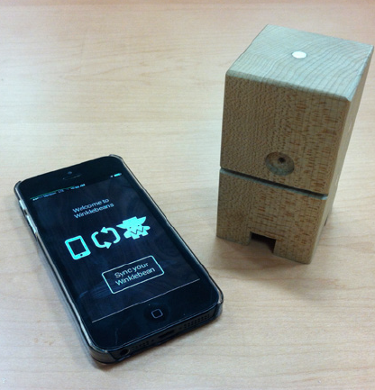

How might connected smart objects become meaningful components of a tangible transmedia storytelling experience?

#### Tangible Storytelling in a New, Connected World

As mainframes gave way to desktops, desktops yielded to laptops, and laptops are yielding to mobiles, mobiles will soon yield to a new connected world of wearable devices, smart objects, smart homes and smart cities. Here at USC’s Annenberg Innovation Lab, we’ve been exploring storytelling in this new world, but because we’re a Think & Do lab, it’s not enough for us to just write a paper; to truly understand this space, we build experimental prototypes to explore the possibilities for authors and audiences alike.

<iframe src="https://player.vimeo.com/video/103361002" width="640" height="360" frameborder="0" webkitallowfullscreen mozallowfullscreen allowfullscreen></iframe>

To do so, we partnered with the creators of the Winklebeans, a line of handcrafted, wooden toy monsters with interchangeable magnetic pieces. Children can assemble, disassemble, and reassemble the Winklebean characters into thousands of unique configurations, which makes the Winklebeans perfect for our exploration into tangible storytelling.

By splicing sensors into the Winklebeans’ magnetic pieces and embedding a tiny PC into its chassis, we transformed the wooden toys into smart objects that could sync up wirelessly with a dynamic book app on a connected mobile device. When a child reconfigured the toy (for example, when the child took the ‘tail’ piece off the rear of the toy and attached it instead to the top of the Winklebean’s head), the storyline in the connected dynamic book app would change. We also embedded a speaker into each toy, which not only allowed the Winklebean to participate in the “performance” of the storytelling by adding its own commentary, but also allowed multiple Winklebeans to vocally react to one another when they were both synced to the same dynamic book app. We also added an element of replayability by including an array of randomized responses that the toy could say at particular trigger moments within the story.

This was a fun project, but it’s only the beginning. Imagine when such a toy gains a greater degree of artificial intelligence, noting how the child plays with it and dynamically updating the story to provide a highly personalized experience. Imagine when the toy can detect where it’s physically located, unlocking additional stories depending on where it is and the path it took to get there, and making suggestions about where the child should take it next. Imagine when the toy itself becomes a recording and sharing device, so the child can tell its own stories to the toy, the toy can share those stories out to an ever-broadening network of other toys and children all over the world, and in exchange the toy can deliver an endless stream of other children’s stories back to the child.

